# Multi-Agent Email Automation + Evals

An **implemented** multi-agent email-triage system for **ByteMart** (Indian e-commerce). Three agents — Retriever, Resolver, Resolver-Reflexive — work over 8 DB tools and clause-aware policy RAG to produce one of 3 terminal outcomes per email. An offline **LLM-as-judge (minimax)** scores 36 held-out emails against a rubric-encoded golden set.

This repo ships the production code, the 36-email held-out eval fixtures, the Markdown policy corpus, and the historical trace + judge logs under `EvalTestLogs/`.

---

## What this is

**ByteMart is an ecommerce platform** — the Email Agentic workflow reads inbound customer emails, retrieves policy + DB context, and produces a grounded reply. It uses:

- **Tools** — 8 LLM-callable functions (DB + RAG) for customer / order / payment / policy lookups
- **Policy-document RAG** — clause-aware parent-child retrieval over a Markdown policy corpus (8 docs, ~340 parents, ~346 children)
- **3 agents** wired by an orchestrator:
  1. **Retriever** — function-calling loop over the tools + agentic RAG over the policies
  2. **Resolver** — generates drafts from the policy info and tool returns (does not decide the final action)
  3. **Resolver-Reflexive** — reviews the draft with a 5-dim rubric (`intent_accuracy`, `faithfulness`, `policy_compliance`, `tone`, `side_effect_consent`); on error it resends the draft back to the Resolver with regeneration hints (bounded by `MAX_RETRIES=2`)

After the workflow runs, every email lands in one of **3 terminal states — `auto_send`, `Hilt`, or `escalate`**. There is no continuation past these states.

---

## Workflow

```mermaid
flowchart LR
    EMAIL([Inbound customer email])

    RETRIEVER["Retriever<br/>tools + agentic RAG"]
    RESOLVER["Resolver<br/>generate draft<br/>from policy + tool returns"]
    REFLEXIVE["Resolver-Reflexive<br/>5-dim rubric"]
    REGEN{"regen hints"}
    ROUTE["Workflow router<br/>3 terminal states"]
    OUT3["auto_send / Hilt / escalate"]

    TRACE["Trace JSON<br/>schema 1.2"]
    LOGS["EvalTestLogs / workflow_runs / &lt;run_id&gt;"]

    JUDGE["LLM-as-judge<br/>minimax"]
    RESULTS["EvalTestLogs / judge_runs / &lt;run_id&gt;"]

    EMAIL --> RETRIEVER
    RETRIEVER --> RESOLVER
    RESOLVER -- draft --> REFLEXIVE
    REFLEXIVE -- accept or escalate --> ROUTE
    REFLEXIVE -- regen hints --> REGEN
    REGEN -- yes, retry up to 2 --> RESOLVER
    REGEN -- exhausted --> ROUTE
    ROUTE --> OUT3
    OUT3 --> TRACE
    TRACE --> LOGS
    LOGS --> JUDGE
    JUDGE --> RESULTS
```



---

## Evals

### Offline evaluation framework

The workflow produces a JSON trace per email (`EvalTestLogs/workflow_runs/<run_id>/<email_id>.json`). The offline eval reads these traces and runs an **LLM-as-judge** powered by **minimax** to score each draft.

This is a separate, offline stage — the eval never reaches back into the workflow. There is no continuation from the eval into a regenerate loop. The 3 terminal states (`auto_send` / `Hilt` / `escalate`) are scored as-is.

> 📊 **Evaluation Results — 29 / 36 Cases Passing (80.6%)**
>
> Workflow action matches the human-curated golden set
> (`data/bytemart_eval/data/eval_golden_set.csv`). Pass criterion:
> `resolver.action == golden.decision`. The 7 mismatches are listed
> under "Outcomes" below.

### Outcomes

- **29 / 36 (80.6%)** — workflow action matches the golden set
- **Decision distribution** (actual, internal 4-way enum preserved in trace):
  - `auto_send` — 19
  - `hilt_refund` — 9
  - `hilt_other` — 6
  - `escalate` — 2
- **Terminal-state distribution** (3-state collapse applied at the workflow outcome level):
  - `auto_send` — 19
  - `Hilt` — 15 (`hilt_refund` + `hilt_other`)
  - `escalate` — 2
- **7 mismatches** (workflow ≠ golden):

| email | expected | actual | outcome | conf |
|---|---|---|---|---|
| E3 | hilt_other | hilt_refund | pending | 0.0 |
| E12 | auto_send | hilt_other | pending | 1.0 |
| E21 | hilt_other | auto_send | pending | 0.0 |
| E28 | auto_send | hilt_refund | pending | 0.0 |
| E29 | auto_send | hilt_refund | pending | 0.0 |
| ES-032 | auto_send | hilt_refund | pending | 0.0 |
| ES-035 | auto_send | hilt_refund | pending | 1.0 |

- Held-out set: 36 emails in `data/bytemart_eval/data/emails.tsv`
- Traces: `EvalTestLogs/workflow_runs/workflow-20260907-221613/`
- Judge output (scaffolded, not yet scored): `EvalTestLogs/judge_runs/judge-20260907-222803/`

### Methodology — Reference-based with rubric list

- **Reference (golden set):** `data/bytemart_eval/data/eval_golden_set.csv`
  - 36 rows, one per eval email
  - Columns: `email_id`, `topic`, `sender_email`, `decision`, `hilt_reason`, `policy_ref`, `required_clauses`, `rubric`
- **Pass criterion** (this run): `resolver.action == golden.decision`
- **Rubric list** (per-email, encoded in the `rubric` column as JSON):
  - **7 universal dims** (every email): `tone_professional`, `clarity_structure`, `completeness`, `no_pii_echo`, `no_fabricated_amounts`, `cites_policy_clause`, `matches_register`
  - **1-3 task-specific dims** per email (e.g. `addresses_birthday_deadline`, `provides_tracking_id`, `mentions_express_surcharge`, `declines_firmly_politely`, `mentions_14d_window`, `cites_Rs5499_not_Rs54990`, `states_payment_methods_supported`)
  - Mix of `likert` (4-pt scale, `expected_min=4`) and `binary` (`expected=true`)
  - Total rubric dimensions across the set: **~308** (avg 8.5 per email)
  - Scoring layers: `judge` (LLM), `regex` (PII redaction), `field` (numerical / clause extraction)
- **Per-email references:**
  - Expected decision (auto_send / hilt_refund / hilt_other / escalate)
  - Expected policy clause(s) to cite (e.g. `shipping §3`, `cancellation §1`)
  - 14-day-window-acknowledgment flag (refund-related emails)

### LLM-as-a-Judge (powered by minimax)

- Provider: **minimax** (via OpenRouter by default; direct MiniMax API as an alternative)
- Activated by `JUDGE_BASE_URL` + `JUDGE_MODEL` + `JUDGE_API_KEY` (see `.env.example`)
- Default config (OpenRouter-routed):
  - `JUDGE_BASE_URL=https://openrouter.ai/api/v1`
  - `JUDGE_MODEL=minimax/minimax-m3:free`
- 5-dimension rubric (`reflexive.dimension_scores`):
  1. `intent_accuracy` ≥ 0.65
  2. `faithfulness` ≥ 0.65
  3. `policy_compliance` ≥ 0.65
  4. `tone` ≥ 0.65
  5. `side_effect_consent` ≥ 0.65
- Pass criterion (judge layer): all 5 dims ≥ 0.65
- **Status:** judge scaffolded but not yet run; `EvalTestLogs/judge_runs/judge-20260907-222803/` manifest shows **0 pass / 0 fail / 308 unscored / $0.00 cost**. The 80.6% above is the deterministic-fallback proxy (`resolver.action == golden.decision`). Running the judge will fill in the 308 dimension scores in `EvalTestLogs/judge_runs/<next_run>/`.

---

## Quick start

```bash
# 1. Local Postgres (one-shot)
docker compose up -d postgres
cp .env.example .env       # then fill OPENAI_API_KEY and JUDGE_API_KEY

# 2. Schema + roles + seed
python scripts/setup_db.py

# 3. Optional: re-ingest policy corpus from data/policies/markdown/*.md
python scripts/ingest_policies_parent_child.py --source markdown

# 4. Run the workflow over the 36-email held-out set
python scripts/run_eval_parallel.py \
    --emails data/bytemart_eval/data/emails.tsv \
    --workers 5 \
    --out EvalTestLogs/workflow_runs/<run_id>/

# 5. Run the offline LLM-as-judge (minimax) over the workflow traces
python scripts/run_eval_parallel.py \
    --judge \
    --workflow-runs EvalTestLogs/workflow_runs/<run_id>/ \
    --out EvalTestLogs/judge_runs/<run_id>/
```

The `EvalTestLogs/README.md` documents the trace schema, judge rubric, and how to add new emails to the held-out set.

---

## Repo layout

```
.
├── README.md                       # this file
├── pyproject.toml                  # package manifest
├── docker-compose.yml              # Postgres for local dev
├── .env.example                    # env template (POSTGRES_*, OPENAI_*, JUDGE_*)
│
├── src/
│   ├── tools.py                    # 8 LLM-callable tools (DB + RAG)
│   ├── rag.py                      # parent-child policy RAG (clause-aware)
│   ├── db.py                       # SQLAlchemy session factory
│   ├── parser.py                   # tool arg validation
│   └── agent/
│       ├── workflow.py             # AM-003 orchestrator
│       ├── retriever_agent/        # AM-001 (function-calling)
│       ├── resolver_agent/         # AM-002 (generates drafts)
│       ├── resolver_reflexive/     # AM-002-R (reviews drafts, 5-dim rubric)
│       ├── retrieval_checks.py     # structural contradiction check
│       ├── tool_failure_checks.py  # tool-error → escalate
│       ├── eval_set.py             # AM-004 sequential eval runner
│       ├── parallel_eval.py        # 5-worker parallel runner
│       ├── judge.py                # provider-agnostic judge client
│       ├── prompts.py + prompt_builder.py
│       ├── types.py                # Email, Trace dataclasses
│       ├── logger.py + metric_tracker.py
│       └── score.py + reflexive_routing.py
│
├── scripts/
│   ├── setup_db.sql + setup_db.py  # schema + roles + seed
│   ├── enrich_products.py          # product enrichment
│   ├── ingest_policies_parent_child.py   # MD/PDF → policy_parents/children
│   ├── pdf_to_markdown.py          # PDF → MD converter
│   ├── run_one.py                  # single-email CLI
│   ├── run_eval.py                 # sequential eval runner
│   └── run_eval_parallel.py        # 5-worker parallel runner
│
├── data/
│   ├── policies/
│   │   ├── bytemart-policy-pack.pdf   # source PDF
│   │   ├── markdown/*.md              # 8 generated clause-aware Markdown files
│   │   └── Products.md                # product enrichment source
│   ├── bytemart_eval/data/            # 36 emails + 8 CSVs (eval fixtures)
│   └── completeBytemartEvalset/       # eval YAML + DB schema docs
│
├── tests/                          # 405 pytest tests across 26 files
│
└── EvalTestLogs/                   # historical eval run artifacts
    ├── workflow_runs/<run_id>/     # 36 per-email traces + manifest
    ├── judge_runs/<run_id>/        # judge output + manifest
    ├── manual_review/              # hand-curated audit traces (E26 series)
    ├── phase1.log + phase2.log
    └── README.md                   # trace schema + how to reproduce
```

`docs/` (planning hub) is local-only and gitignored.

---

## The 8 LLM-callable tools

Implemented in `src/tools.py`. All tools execute against the read-only `evaluator` Postgres role.

| # | Tool | Args | Tables touched | Purpose |
|---|---|---|---|---|
| 1 | `lookup_customer` | `email` | `customers` | Resolve a sender email to a customer row |
| 2 | `lookup_order_by_id` | `order_id` | `orders`, `order_items`, `payments` | Single-order lookup by `BM…` id |
| 3 | `lookup_order_by_sender_and_product` | `email`, `product_hint` | `orders`, `order_items` | Disambiguate when customer has multiple orders |
| 4 | `lookup_payment_by_transaction_id` | `transaction_id`, `customer_email?` | `payments`, `customers` | Triage payment-side escalations |
| 5 | `lookup_payments_for_order` | `customer_email`, `order_id?`, `amount?`, `status?` | `payments`, `orders` | Filter payments by partial criteria |
| 6 | `lookup_orphan_payment` | `amount`, `status` | `payments` | Find payments without a matching order |
| 7 | `get_product_details` | `sku \| name_hint` | `products` | Enrich product info (warranty, returns) |
| 8 | `lookup_policy` | `query`, `top_k=3` | (parent-child RAG) | Retrieve policy clauses |

Each tool returns `{found: bool, row: dict | rows: list[dict]}` plus tool-call metadata (`duration_ms`, `result`). Tool-call errors are caught in `src/agent/tool_failure_checks.py` and routed to `escalate`.

---

## The policy RAG (parent-child, clause-aware)

Source: 8 Markdown files in `data/policies/markdown/`, derived from the original PDF (`data/policies/bytemart-policy-pack.pdf`) via `scripts/pdf_to_markdown.py`.

**Ingestion pipeline** (`scripts/ingest_policies_parent_child.py`):

```
Markdown source (YAML frontmatter + clause headers)
    │
    ▼
_split_into_clauses()       # splits on "§N.M" and "N. Title" patterns
    │
    ▼
_pack_clauses()             # paragraph-pack fallback when <2 clause headers
    │
    ▼
Parent chunks              # one parent per clause; has clause_anchor, line_from, line_to
    │                       # token_count ≈ RAG_PARENT_TOKENS (1200)
    ▼
Child chunks               # 300-token sliding windows, 75-token overlap
    │
    ▼
Embeddings                 # OpenAI text-embedding-3-small (or hash fallback)
    │
    ▼
Postgres: policy_parents + policy_children
```

**Retrieval** (`src/rag.py::lookup_policy`):

1. Embed the query → cosine against child embeddings
2. Take top-k children → roll up to their parent (1 parent may have many children)
3. Re-rank parents by `best_clause_for_query()` (term-overlap score within the parent)
4. Return `PolicyHit{doc_id, similarity, clause_anchor, text}`

**Schema columns** (Postgres `app.policy_parents`):

```
parent_id, doc_id, version, page_from, page_to,
line_from, line_to, clause_anchor, text, token_count, created_at
```

`clause_anchor` lets the Resolver cite specific clauses (e.g. `payment-policy §5.1`) and lets the structural contradiction check ignore cross-doc repetitions.

---

## The agents

| Agent | Spec | Module | Responsibility |
|---|---|---|---|
| **AM-001 Retriever** | `docs/specs/AM-001-get-customer-info.md` | `src/agent/retriever_agent/` | Function-calling loop over the 8 tools. Returns `RetrieverContext{tool_calls[], policies[], customer}` |
| **AM-002 Resolver** | `docs/specs/AM-002-get-order-info.md` | `src/agent/resolver_agent/` | **Generates drafts** from policy info + tool returns; produces `ResolverResult{intent, action, draft, self_check, hilt_reason}`. Does not decide the final workflow outcome |
| **AM-002-R Reflexive** | — | `src/agent/resolver_reflexive/` | **Reviews the draft with a 5-dim rubric** (intent_accuracy, faithfulness, policy_compliance, tone, side_effect_consent); emits `accept` / `regenerate` (with hints) / `escalate`. On `regenerate`, the workflow resends the draft to the Resolver, bounded by `MAX_RETRIES=2` |
| **AM-003 Workflow** | — | `src/agent/workflow.py` | Orchestrator: drives the regenerate loop, then routes to **3 terminal states** — `auto_send`, `Hilt`, `escalate`. No continuation past these states |

Each agent uses its own prompts in `src/agent/<agent>/prompts/{role, guardrails, few_shot_examples, state_examples, tools}`.

---

## The 36-email eval set

Held-out set in `data/bytemart_eval/data/emails.tsv` (TSV with header `email_id  subject  email_content  order_id  order_item  sender_email  register_email`).

| Range | Count | Theme |
|---|---|---|
| `E1..E30` | 30 | Single-product, single-order scenarios |
| `ES-031..ES-036` | 6 | Edge cases (multi-order, orphan payment, dispute, grievance, info-only, refund-after-15-days) |

Each row pairs with a row in `data/bytemart_eval/data/eval_golden_set.csv` containing the expected `intent`, `decision`, cited policy clause, customer/order references, and per-email rubric.

The pipeline does **not** see the golden set during run; it appears only in `EvalTestLogs/judge_runs/<run_id>/judge.yaml`.

---

## Harness intro

Two runners:

| Runner | Script | Use case |
|---|---|---|
| Sequential | `scripts/run_eval.py` | Debug, small runs, smoke tests |
| Parallel (5 workers) | `scripts/run_eval_parallel.py` | The 36-email set, ~3-5x speedup |

Both write traces to `EvalTestLogs/workflow_runs/<run_id>/<email_id>.json` and a `manifest.json` with `n_emails`, `n_succeeded`, decision counts, parallelism.

Single-email CLI (`scripts/run_one.py`) writes to a custom `--trace-dir` for debugging specific cases. `--deterministic-fallback` patches only the agent LLM factories (not RAG embeddings) so the retriever still uses real embeddings while the LLM steps use deterministic scoring.

---

## What "shipped" looks like

- **Eval log example:** `EvalTestLogs/workflow_runs/workflow-20260907-221613/manifest.json` — 36/36 succeeded, 19 auto_send / 9 hilt_refund / 6 hilt_other / 2 escalate (internal 4-way enum); 19 auto_send / 15 Hilt / 2 escalate (3-state collapse)
- **Manual review example:** `EvalTestLogs/manual_review/E26_with_fixes_v3/E26_V3.json` — held-out "Crypto Nintendo Switch" email, traced end-to-end

---

## License & status

- **License:** MIT (placeholder — adjust before public release)
- **Status:** v3.0 (implemented reference); 405 pytest tests pass; 36-email harness reproducible; 29/36 (80.6%) pass rate against golden set
- **Next:** activate the LLM-as-judge layer (`JUDGE_BASE_URL` / `JUDGE_MODEL` / `JUDGE_API_KEY` in `.env`) to fill in the 308 per-dimension scores in `EvalTestLogs/judge_runs/<next_run>/`
