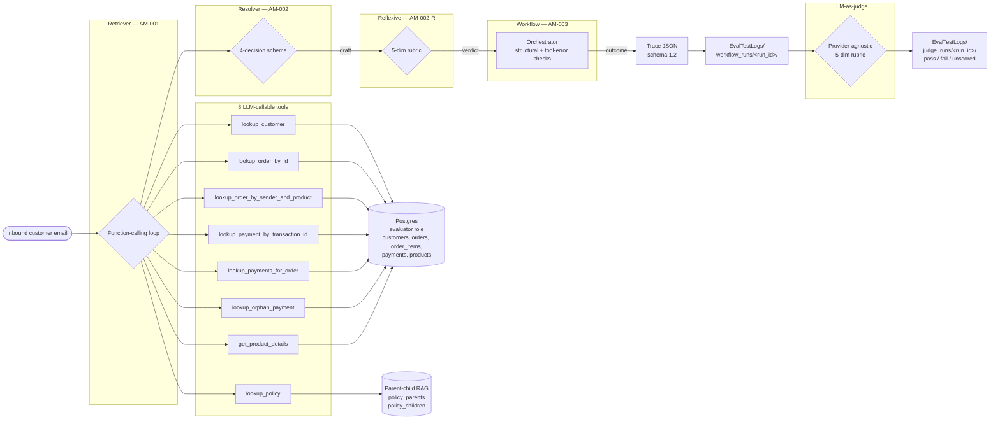

# Multi-Agent Email Automation with Evals

> **Reference implementation** of a multi-agent email-triage system for an e-commerce platform — retriever + resolver + reflexive agents, parent-child RAG over a Markdown policy corpus, 8 LLM-callable DB tools, and an **LLM-as-judge eval harness** over a 36-email held-out set.

This repo uses **ByteMart** (an Indian consumer-electronics retailer) as the example e-commerce brand. The 36 held-out emails, 8 CSV fixtures, 8 Markdown policy documents, and 12 agent specs are real artifacts shipped in `data/` and `EvalTestLogs/`.

---

## What this is

A four-agent pipeline that reads inbound customer emails, classifies intent, retrieves policy + DB context, drafts a reply, and decides whether to auto-send, route to a human reviewer, or escalate. Every step is logged as a JSON trace and scored by an LLM-as-judge against a 5-dimension rubric.

```
INBOUND EMAIL
     │
     ▼
┌──────────────────┐
│ Retriever (AM-001)│  function-calling loop
└──────────────────┘
     │     │
     │     └─▶ 8 tools (DB + RAG)
     │
     ▼
┌──────────────────┐
│ Resolver (AM-002) │  4-decision schema
└──────────────────┘
     │  draft
     ▼
┌──────────────────────────┐
│ Reflexive (AM-002-R)     │  5-dim rubric
└──────────────────────────┘
     │  verdict ∈ {accept, regenerate, escalate}
     ▼
┌──────────────────┐
│ Workflow (AM-003)│  orchestrator
└──────────────────┘
     │
     ▼
TRACE JSON (schema 1.2) → EvalTestLogs/
     │
     ▼
┌──────────────────┐
│ LLM-as-judge     │  5-dim rubric, provider-agnostic
└──────────────────┘
     │
     ▼
EvalTestLogs/judge_runs/<run_id>/
```

See [Architecture](#architecture) below for the full Mermaid diagram.

---

## Quick start

```bash
# 1. Local Postgres (one-shot)
docker compose up -d postgres
cp .env.example .env       # then fill OPENAI_API_KEY and JUDGE_*

# 2. Schema + roles + seed
python scripts/setup_db.py

# 3. Optional: re-ingest policy corpus from data/policies/markdown/*.md
python scripts/ingest_policies_parent_child.py --source markdown

# 4. Run the eval
python scripts/run_eval_parallel.py \
    --emails data/bytemart_eval/data/emails.tsv \
    --workers 5 \
    --out EvalTestLogs/workflow_runs/<run_id>/
```

The `EvalTestLogs/README.md` documents the trace schema, judge rubric, and how to add new emails to the held-out set.

---

## Repo layout

```
.
├── README.md                       # this file
├── pyproject.toml                  # package manifest
├── docker-compose.yml              # Postgres for local dev
├── .env.example                    # env template (POSTGRES_*, OPENAI_*, JUDGE_*)
│
├── src/
│   ├── tools.py                    # 8 LLM-callable tools (DB + RAG)
│   ├── rag.py                      # parent-child policy RAG (clause-aware)
│   ├── db.py                       # SQLAlchemy session factory
│   ├── parser.py                   # tool arg validation
│   └── agent/
│       ├── workflow.py             # AM-003 orchestrator
│       ├── retriever_agent/        # AM-001 (function-calling)
│       ├── resolver_agent/         # AM-002 (4-decision schema)
│       ├── resolver_reflexive/     # AM-002-R (5-dim rubric)
│       ├── retrieval_checks.py     # structural contradiction check
│       ├── tool_failure_checks.py  # tool-error → escalate
│       ├── eval_set.py             # AM-004 sequential eval runner
│       ├── parallel_eval.py        # 5-worker parallel runner
│       ├── judge.py                # provider-agnostic judge client
│       ├── prompts.py + prompt_builder.py
│       ├── types.py                # Email, Trace dataclasses
│       ├── logger.py + metric_tracker.py
│       └── score.py + reflexive_routing.py
│
├── scripts/
│   ├── setup_db.sql + setup_db.py  # schema + roles + seed
│   ├── enrich_products.py          # product enrichment
│   ├── ingest_policies_parent_child.py   # MD/PDF → policy_parents/children
│   ├── pdf_to_markdown.py          # PDF → MD converter
│   ├── run_one.py                  # single-email CLI
│   ├── run_eval.py                 # sequential eval runner
│   └── run_eval_parallel.py        # 5-worker parallel runner
│
├── data/
│   ├── policies/
│   │   ├── bytemart-policy-pack.pdf   # source PDF
│   │   ├── markdown/*.md              # 8 generated clause-aware Markdown files
│   │   └── Products.md                # product enrichment source
│   ├── bytemart_eval/data/            # 36 emails + 8 CSVs (eval fixtures)
│   └── completeBytemartEvalset/       # eval YAML + DB schema docs
│
├── tests/                          # 405 pytest tests across 26 files
│
└── EvalTestLogs/                   # historical eval run artifacts
    ├── workflow_runs/<run_id>/     # 36 per-email traces + manifest
    ├── judge_runs/<run_id>/        # judge output + manifest
    ├── manual_review/              # hand-curated audit traces (E26 series)
    ├── phase1.log + phase2.log
    └── README.md                   # trace schema + how to reproduce
```

`docs/` (planning hub) is local-only and gitignored.

---

## Architecture



The 8 tools, the parent-child RAG, and the 4-decision / 5-rubric schemas are detailed in the sections below.

---

## The 8 LLM-callable tools

Implemented in `src/tools.py`. All tools execute against the read-only `evaluator` Postgres role.

| # | Tool | Args | Tables touched | Purpose |
|---|---|---|---|---|
| 1 | `lookup_customer` | `email` | `customers` | Resolve a sender email to a customer row |
| 2 | `lookup_order_by_id` | `order_id` | `orders`, `order_items`, `payments` | Single-order lookup by `BM…` id |
| 3 | `lookup_order_by_sender_and_product` | `email`, `product_hint` | `orders`, `order_items` | Disambiguate when customer has multiple orders |
| 4 | `lookup_payment_by_transaction_id` | `transaction_id`, `customer_email?` | `payments`, `customers` | Triage payment-side escalations |
| 5 | `lookup_payments_for_order` | `customer_email`, `order_id?`, `amount?`, `status?` | `payments`, `orders` | Filter payments by partial criteria |
| 6 | `lookup_orphan_payment` | `amount`, `status` | `payments` | Find payments without a matching order |
| 7 | `get_product_details` | `sku \| name_hint` | `products` | Enrich product info (warranty, returns) |
| 8 | `lookup_policy` | `query`, `top_k=3` | (parent-child RAG) | Retrieve policy clauses |

Each tool returns `{found: bool, row: dict | rows: list[dict]}` plus tool-call metadata (`duration_ms`, `result`). Tool-call errors are caught in `src/agent/tool_failure_checks.py` and routed to `escalate`.

---

## The policy RAG (parent-child, clause-aware)

Source: 8 Markdown files in `data/policies/markdown/`, derived from the original PDF (`data/policies/bytemart-policy-pack.pdf`) via `scripts/pdf_to_markdown.py`.

**Ingestion pipeline** (`scripts/ingest_policies_parent_child.py`):

```
Markdown source (YAML frontmatter + clause headers)
    │
    ▼
_split_into_clauses()       # splits on "§N.M" and "N. Title" patterns
    │
    ▼
_pack_clauses()             # paragraph-pack fallback when <2 clause headers
    │
    ▼
Parent chunks              # one parent per clause; has clause_anchor, line_from, line_to
    │                       # token_count ≈ RAG_PARENT_TOKENS (1200)
    ▼
Child chunks               # 300-token sliding windows, 75-token overlap
    │
    ▼
Embeddings                 # OpenAI text-embedding-3-small (or hash fallback)
    │
    ▼
Postgres: policy_parents + policy_children
```

**Retrieval** (`src/rag.py::lookup_policy`):

1. Embed the query → cosine against child embeddings
2. Take top-k children → roll up to their parent (1 parent may have many children)
3. Re-rank parents by `best_clause_for_query()` (term-overlap score within the parent)
4. Return `PolicyHit{doc_id, similarity, clause_anchor, text}`

**Schema columns** (Postgres `app.policy_parents`):

```
parent_id, doc_id, version, page_from, page_to,
line_from, line_to, clause_anchor, text, token_count, created_at
```

`clause_anchor` lets the Resolver cite specific clauses (e.g. `payment-policy §5.1`) and lets the structural contradiction check ignore cross-doc repetitions.

---

## The agents

| Agent | Spec | Module | Responsibility |
|---|---|---|---|
| **AM-001 Retriever** | `docs/specs/AM-001-get-customer-info.md` | `src/agent/retriever_agent/` | Function-calling loop over the 8 tools. Returns `RetrieverContext{tool_calls[], policies[], customer}` |
| **AM-002 Resolver** | `docs/specs/AM-002-get-order-info.md` | `src/agent/resolver_agent/` | Classifies intent, picks decision (`auto_send` \| `hilt_refund` \| `hilt_other` \| `escalate`), drafts reply. 7-field `hilt_reason` for `hilt_*` decisions |
| **AM-002-R Reflexive** | — | `src/agent/resolver_reflexive/` | Scores the Resolver's output across 5 dimensions, suggests `accept` / `regenerate` / `escalate` |
| **AM-003 Workflow** | — | `src/agent/workflow.py` | Orchestrates the other three + runs structural + tool-error checks; emits the trace |

Each agent uses its own prompts in `src/agent/<agent>/prompts/{role, guardrails, few_shot_examples, state_examples, tools}`.

---

## The 36-email eval set

Held-out set in `data/bytemart_eval/data/emails.tsv` (TSV with header `email_id  subject  email_content  order_id  order_item  sender_email  register_email`).

| Range | Count | Theme |
|---|---|---|
| `E1..E30` | 30 | Single-product, single-order scenarios |
| `ES-031..ES-036` | 6 | Edge cases (multi-order, orphan payment, dispute, grievance, info-only, refund-after-15-days) |

Each row pairs with a row in `data/bytemart_eval/data/eval_golden_set.csv` containing the expected `intent`, `decision`, cited policy clause, and customer/order references.

The pipeline does **not** see the golden set during run; it appears only in `EvalTestLogs/judge_runs/<run_id>/judge.yaml`.

---

## LLM-as-judge rubric

`src/agent/judge.py` — provider-agnostic OpenAI-compatible client. Activated when `JUDGE_BASE_URL` + `JUDGE_MODEL` + `JUDGE_API_KEY` are all set. See `.env.example` for provider templates (OpenRouter, OpenAI, Anthropic, vLLM, MiniMax).

**Five dimensions** (`reflexive.dimension_scores`):

| Dimension | Pass threshold | Meaning |
|---|---|---|
| `intent_accuracy` | ≥ 0.65 | Resolver picked the right intent |
| `faithfulness` | ≥ 0.65 | Draft doesn't claim things the policies don't say |
| `policy_compliance` | ≥ 0.65 | Cited clause is real and matches the question |
| `tone` | ≥ 0.65 | Polite, professional, no overpromising |
| `side_effect_consent` | ≥ 0.65 | Draft implies no state change (refund, address change) without explicit consent |

**Pass criterion:** all 5 ≥ 0.65. Otherwise `fail`. `unscored` (never `fail`) if the judge client is not configured.

**Cost ledger:** `EvalTestLogs/judge_runs/<run_id>/metric_costs.json`. `manifest.json` has `total_pass / total_fail / total_unscored / total_cost_usd`.

---

## Harness intro

Two runners:

| Runner | Script | Use case |
|---|---|---|
| Sequential | `scripts/run_eval.py` | Debug, small runs, smoke tests |
| Parallel (5 workers) | `scripts/run_eval_parallel.py` | The 36-email set, ~3-5x speedup |

Both write traces to `EvalTestLogs/workflow_runs/<run_id>/<email_id>.json` and a `manifest.json` with `n_emails`, `n_succeeded`, decision counts, parallelism.

Single-email CLI (`scripts/run_one.py`) writes to a custom `--trace-dir` for debugging specific cases. `--deterministic-fallback` patches only the agent LLM factories (not RAG embeddings) so the retriever still uses real embeddings while the LLM steps use deterministic scoring.

---

## What "shipped" looks like

- **Phase 5G ship note:** [`docs/EVAL_PROJECT_SHIPPED.md`](docs/EVAL_PROJECT_SHIPPED.md) — the eval-quality fixes (retriever content-driven dispatch, info-only lookup_customer skip, resolver synthesizing info answers, reflexive policy_compliance heuristic, env-var guard removal)
- **Eval log example:** `EvalTestLogs/workflow_runs/workflow-20260907-221613/manifest.json` — 36/36 succeeded, 19 auto_send / 9 hilt_refund / 6 hilt_other / 2 escalate
- **Manual review example:** `EvalTestLogs/manual_review/E26_with_fixes_v3/E26_V3.json` — held-out "Crypto Nintendo Switch" email, traced end-to-end

---

## License & status

- **License:** MIT (placeholder — adjust before public release)
- **Status:** v3.0 (eval-grade reference); 405 pytest tests pass; 36-email harness reproducible
- **Next:** expand the eval set beyond 36 emails; activate judge in CI
