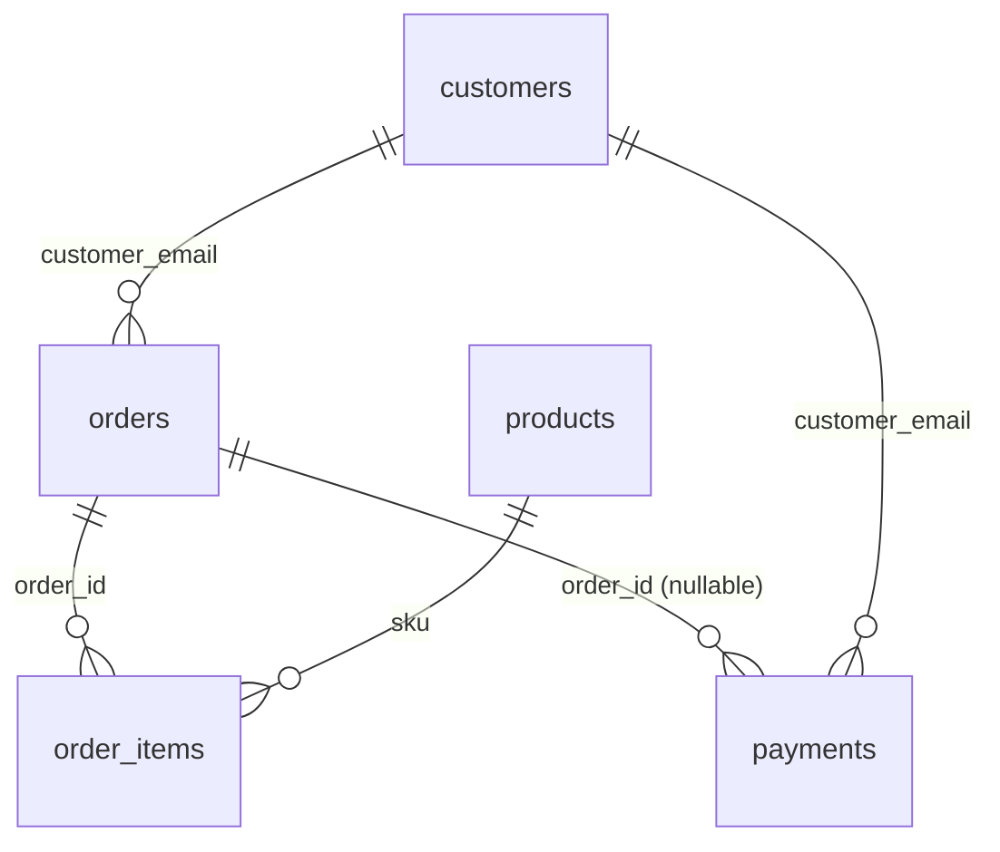

# TABLE — schema reference (to the point)

_Generated 2026-09-06T15:21:25Z from `bytemart_eval.zip`._

## Tables (5)

| Table | Purpose | PK | Key columns | Rows |
|---|---|---|---|---:|
| `customers` | Account + order count (trigger-maintained) | `email` | `full_name, account_status, no_of_orders` | 36 |
| `products` | SKU catalog | `sku` | `name, category, unit_price, in_stock` | 20 |
| `orders` | Order header + JSONB cache | `order_id` | `customer_email FK, items jsonb, total_amount, current_status` | 28 |
| `order_items` | Normalized line items | `(order_id, line_no)` | `sku FK, qty, unit_price, line_total` | 31 |
| `payments` | All transactions (incl. failed) | `payment_id` | `order_id FK?, amount, method, status, transaction_id` | 33 |

## Triggers (2)

| Trigger | Fires when | Maintains |
|---|---|---|
| `trg_order_count` | `AFTER INSERT OR DELETE ON orders` | `customers.no_of_orders` |
| `trg_sync_order_items_cache` | `AFTER INSERT OR UPDATE OR DELETE ON order_items` | `orders.items jsonb` + `orders.total_amount` |

## View (1)

| View | Purpose |
|---|---|
| `order_summary` | One row per order, joined with item + payment totals (read-only; eval inspection) |

## FK graph



Plain text:

- `customers.email ──► orders.customer_email`
- `orders.order_id ──► order_items.order_id`
- `products.sku ──► order_items.sku`
- `orders.order_id ──► payments.order_id` (nullable: `failed` payments have no order)
- `customers.email ──► payments.customer_email`

## CHECK constraints

| Constraint | Table | Condition |
|---|---|---|
| `customers.account_status` | customers | ∈ {active, inactive, suspended} |
| `products.sku` | products | matches `^[A-Z0-9-]{{3,16}}$` |
| `products.category` | products | ∈ {gaming_console, gaming_desktop, game_controller, gaming_keyboard, gaming_mouse, racing_wheel, vr_headset, monitor, audio, service_fee} |
| `products.unit_price` | products | `> 0` |
| `orders.order_id` | orders | matches `^[A-Za-z]{{2}}[0-9]{{6}}$` |
| `orders.payment_method` | orders | ∈ {card, upi, cod} |
| `orders.current_status` | orders | ∈ {placed, paid, shipped, delivered, cancelled, refunded, returned} |
| `order_items.line_total` | order_items | `= qty × unit_price` |
| `payments.status` | payments | success/refunded/partially_refunded ⇒ `order_id NOT NULL`; failed ⇒ `order_id IS NULL`; pending allowed either |

## `products.category` enum (10 values, post-restructure)

```
gaming_console, gaming_desktop, game_controller,
gaming_keyboard, gaming_mouse, racing_wheel,
vr_headset, monitor, audio, service_fee
```

## Indexes (selected)

| Table | Index |
|---|---|
| `customers` | PK on `email` |
| `products` | PK on `sku` |
| `orders` | PK on `order_id`; case-insensitive unique on `lower(order_id)`; BTREE on `customer_email`, `current_status` |
| `order_items` | PK on `(order_id, line_no)`; BTREE on `sku`, `order_id` |
| `payments` | PK on `payment_id`; BTREE on `(customer_email, status)`, `order_id`, `transaction_id` |

## Documented divergences vs `spec.md §4.1`

- Spec lists more `products` columns (`brand, subcategory, currency, stock_count, availability, warranty, specs, image_url, product_id`) that the bundle's `schema.sql` doesn't carry. Intentional — bundle is the source of truth per project convention.